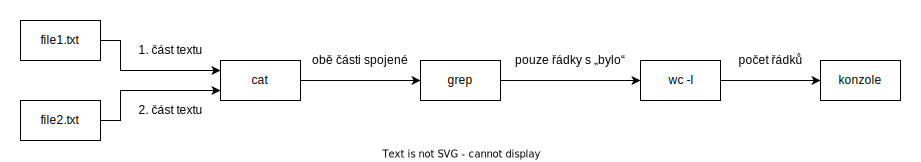

# Standardní vstup a výstup

Všechny úlohy v Pardubickém hackerovi jsou založené na práci s takzvanými standardními proudy. Tato stránka je zběžně představuje.

## Standardní vstup

Standardní vstup, anglicky *standard input* nebo *stdin*, je rozhraní, kterým data **vstupují do programu**.

Pokud jste někdy vytvářeli konzolovou aplikaci, nejspíš jste se s ním již setkali. Program se spustí a uživatel zadá do konzole nějaký text. Následně jej odešle (většinou zapsáním nového řádku, tedy stiskem Enteru) a text se přenese do programu přes jeho standardní vstup. Program tento text poté může načíst.

Jednou z vlastností stdin (a všech standardních proudů) je, že se v něm **nelze vracet zpět k již přečteným datům**. Ta přicházejí za sebou **v pořadí, v jakém byla zapsána**. Program sice nemusí číst všechna data naráz, ale jakmile nějakou část načte, znovu ji číst nemůže. Tomuto chování napovídá i název *proud* či *tok dat* – co z něj jednou „vyteče“, k tomu se nejde vrátit. Je zodpovědností programu si v případě potřeby načtená data ukládat, aby s nimi mohl pracovat zpětně.

Ne všechny programy musí data ze stdin načítat. Kupříkladu program sloužící k pouhému výpisu detailů o souboru může svůj stdin ignorovat.

## Standardní výstup

Standardní výstup, anglicky *standard output* nebo *stdout*, je rozhraní, kterým naopak **program** **data** **předává ven**.

V konzolových aplikacích se s ním také setkáte – ve chvíli, kdy program vypíše do konzole nějaký text. Program musel tento text zapsat na standardní výstup a váš příkazový řádek jej poté zobrazil.

Podobně jako u stdin, program není povinnen svá data na stdout zapisovat. Slouží-li program například jen k manipulaci se soubory, není důvod k výstupu nějakých dat.

## Standardní chybový výstup

Standardní chybový výstup, anglicky *standard error* nebo *stderr*, je rozhraní podobné stdout. Program jím data také předává ven, ale je především **určen k hlášením o chybách a běhu programu**.

Do konzole se obvykle vypisuje společně se stdout, je na něm však zcela nezávislý. Výhodou jeho použití je, že lze oddělit data, jež jsou výsledkem práce programu (ta jdou na stdout) a informace o jeho průběhu.

Stejně jako standardní vstup a výstup, nemusí být stderr programem využit.

## Řešení úloh

Zadání úlohy vždy definuje, jaká data (text) budou na standardním vstupu vašeho programu. Úkolem je tato data načíst, zpracovat a odpověď vypsat v zadané formě na standardní výstup.

Poté, co své řešení na webu semináře odevzdáte, systém mu na standardní vstup pošle testovací data. Ze standardního výstupu vašeho programu načte odpověď a ověří, zda je správná.

V případě, že došlo k chybě, uvidíte ve webovém prostředí výstup ze standardního chybového výstupu kontrolního systému. Váš program s ním pracovat nebude.

## Přesměrování

Data ze standardního výstupu nemusí být vždy zobrazována uživateli. Mohou být také předána ke zpracování jinému programu – zase na jeho standardní vstup. Takto lze napojit i několik programů za sebou, což bývá velmi užitečné. Kupříkladu, kdybychom chtěli zjistit, na kolika řádcích se slovo „bylo“ dohromady vyskytuje ve dvou textových souborech.

Pozn.: Následující ukázka platí zejména pro Linux a MacOS. Na Windows nejsou tyto příkazy bez doinstalace dostupné.

file1.txt:

```
Těm, co je dobře, bylo by lépe,
bylo-li by lépe těm, co je hůře,
```

file2.txt:

```
což ale nejde, aniž by těm,
co je dobře, bylo hůře.
```

Prvním příkazem, který použijeme je `cat`. Když v příkazovém řádku za jeho název napíšeme nějaké soubory oddělené mezerou, `cat` na stdout vypíše jejich obsah spojený za sebe. Tedy

```
cat file1.txt file2.txt
```

by vypsalo

```
Těm, co je dobře, bylo by lépe,
bylo-li by lépe těm, co je hůře,
což ale nejde, aniž by těm,
co je dobře, bylo hůře.
```

Nyní využijeme příkaz `grep`, za jehož název se píše hledaný text. Ze vstupního textu, který `grep` dostane na svůj stdin, vypíše ty řádky, které onen text obsahují. Tomuto příkazu bychom nyní chtěli předat text, který vyjde ze stdout předchozího `cat`u. K tomu v příkazovém řádku slouží svislítko (`|`) – vložíme jej mezi dva příkazy a **výstup prvního se přesměruje do vstupu druhého**:

```
cat file1.txt file2.txt | grep "bylo"
```

Výstupem je

```
Těm, co je dobře, **bylo** by lépe,
**bylo**-li by lépe těm, co je hůře,
co je dobře, **bylo** hůře.
```

`cat` spojil soubory a zapsal na stdout. Z toho data přetekla do stdin `grep`u a ten na svůj stdout vypsal řádky obsahující „bylo“. To už je skoro hotovo, my ale potřebujeme číselný údaj – kolik takových řádků je. K tomuto účelu slouží příkaz `wc` (word count). Na stdin dostane text a v základním nastavení zapíše na stdout počet řádků, slov a znaků v něm. Pomocí přepínače `-l` (lines) lze změnit jeho chování, aby vypisoval pouze první údaj. Do jeho vstupu přesměrujeme předchozí výstup `grep`u, a to stejným způsobem, jako z `cat` do `grep`, čili svislítkem:

```
cat file1.txt file2.txt | grep "bylo" | wc -l
```

Výsledkem je očekávané

```
3
```

Diagram takového toku dat:



Toto je příklad jednoho z mnoha využití standardních proudů. Jistě si dovedete představit, že přesměrování dat mezi programy skýtá velké možnosti.