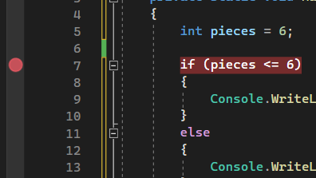
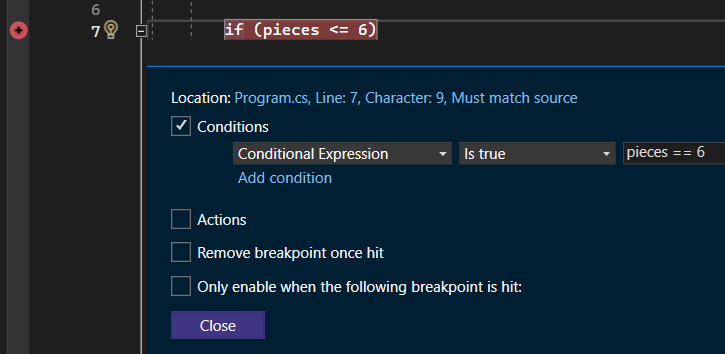
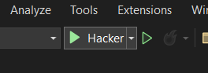
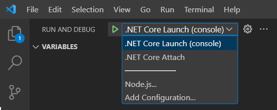
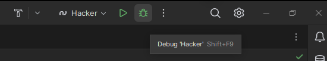
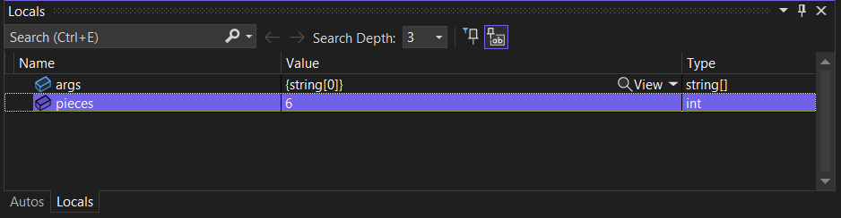

# Debugování

Takřka nevyhnutelnou situací při programování je, že v určité chvíli udělá program něco, co nebylo očekáváno. A když na první pohled není zřejmé, kde nastala chyba, přichází čas ji najít. Tato stránka obsahuje základní doporučení pro hledání a řešení takových chyb (bugů).

Mějme následující program v jazyce C# pro vypisování počtu kusů nějakého produktu na skladě. Když je jich méně než 5, vypíše se jejich počet. Když je jich více, vypíše se pouze “5 nebo více” – třeba aby konkurenční eshop neznal plnost našeho skladu.

```csharp
int pieces = 3;

if (pieces <= 6)
{
    Console.WriteLine("pieces: " + pieces);
}
else
{
    Console.WriteLine("pieces: 5 or more");
}
```

Po spuštění dostaneme očekáváné

```
pieces: 3
```

A když upravíme proměnnou `int pieces = 10`, potom

```
pieces: 5 or more
```

Při `int pieces = 6` však dojde k vypsání nesprávného

```
pieces: 6
```

V tomto případě je chyba v programu očividná a řešení triviální. Následující tipy však přijdou vhod ve složitějších scénářích.

Při vyskytnutí chyby, která nemá jasnou příčinu, je velmi užitečná možnost vidět běh programu v reálném čase. K tomu v editorech (IDE) slouží takzvané **breakpointy**. Ve většině IDE se přidávají kliknutím napravo od řádku kódu, na kterém se má běh zastavit. Ukázka z Visual Studia:



Rozkliknutím pravým tlačítkem lze nastavit i podmínku, při které se má breakpoint aktivovat. Ta se píše stejným způsobem, jako v kódu, např. `pieces == 6`. Může se hodit třeba v cyklech, když nás zajímají jen iterace splňující určité vlastnosti.



Aby byly breakpointy při běhu zaznamenány, je nutné program spustit v režimu debugování. Ve Visual Studiu je to větší ze dvou tlačítek:



Visual Studio Code má nabídku v kartě Run and debug v levém panelu:



nebo někdy v pravém horním rohu:


V IDE od JetBrains je tlačítko s ikonou brouka:



Po spuštění se běh skutečně zastaví a to těsně před tím, než se zvýrazněný řádek s breakpointem vykoná. V rozhraní IDE se objeví ovládací prvky:

- *step over* pro vykonání dalšího kroku,
- *******step in******* vás v případě, že stojíte na řádku s funkcí přenese do ní,
- *step out* naopak vyskočí s funkce ven
- *********continue********* nechá program běžet do dalšího breakpointu nebo do konce.

V IDE sekci *variables* či *locals* se zobrazují existující proměnné. Pravým tlačítkem se dají různě připínat, abyste měli ty důležité stále na očích. Je vidět jejich aktuální hodnota a lze ji dokonce změnit.



Když se proklikáme během programu (step over), zjistíme, že skutečně přešel do větve, kde se vypisuje konkrétní počet kusů. Znamená to, že byla splněna podmínka `if (pieces <= 6)`, což není žádoucí – měla se vykonat druhá větev programu. Tím se dostáváme k samotné chybě, totiž podmínce: když je `pieces` menší než nebo rovno 6. Vypsat přesný počet produktů by se rozhodně neměl, když se rovná 6 – použijeme tedy ostré `<`. Ani to však ještě není zcela správně. Touto podmínkou by prošlo i `pieces` rovné 5, v takovém případě se má ale vypsat `5 or more`. 6 tedy přepíšeme na 5 a výsledná správná podmínka zní `if (pieces < 5)`.

Debugování a využití breakpointů je často opomíjená schopnost. Přitom dokáže ušetřit mnoho času i zdraví. Vypisování hodnot proměnných či různých značek do konzole je také varianta, ovšem výrazně méně elegantní i účinná.

## Valgrind

Programátoři v jazycích C, C++ a podobných mají paměť počítače pod vlastní správou. Může se stát, že ve svém programu zapomenou uvolnit paměť, kterou předtím alokovali. Dochází tak k únikům paměti (angl. memory leak). K jejich detekci slouží program Valgrind. Jeho instalaci můžeme k těmto jazykům jen doporučit, necháme ji však na vás. JetBrains CLion pro něj má i zabudovanou integraci.