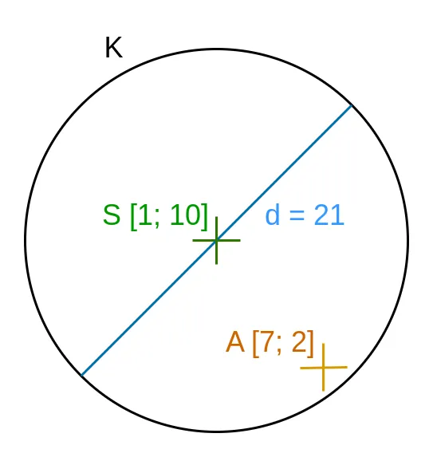

# Bod v kruhu


Na rovině leží kruh K. Na vstupu programu bude na samostatných řádcích

- jeho průměr,
- souřadnice jeho středu (x, y),
- souřadnice bodu A (x, y).

Průměr i souřadnice jsou desetinná čísla. Souřadnice jsou v rozsahu od -10 000 do 10 000. Průměr je kladný a do 10 000.

Úkolem je vypsat, zda A leží (`inside`) nebo neleží (`outside`) v K.

Pozn.: bod se nemusí nacházet uvnitř kruhu – když je „na kraji“ (na jeho kružnici), i to znamená, že leží v něm.

Nápověda: při řešení se může hodit [Pythagorova věta](https://cs.wikipedia.org/wiki/Pythagorova_v%C4%9Bta).

## Příklad

### Vstup

```
21
1
10
7
2
```

### Výstup

```
inside
```

### Vysvětlení

Podle vstupu vypadá rovina (přibližně) takto:



A tedy leží v K.

---

- [řešení](reseni)
- [testy](testy)
