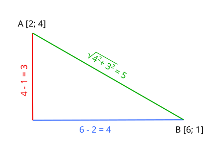

# Bod v kruhu – řešení

Toto je první úloha, v jejímž autorském řešení jsou použity funkce. Těm se věnujeme
v [těchto studijních materiálech](/studijni-materialy/05-funkce).

Jelikož je potřeba načíst pět desetinných čísel, a kód pro načtení by se tedy několikrát opakoval, v C# a Pythonu je k
tomu vytvořena funkce. Ta načte řádek ze vstupu, převede jej na desetinné číslo a to vrátí. Potom se tato funkce jen
pětkrát zavolá. Toto v ostatních jazycích není potřeba nebo nedává smysl.

Klíčovým bodem programu je funkce s názvem `liesInside` (*leží uvnitř*). Ta přijímá všech pět načtených údajů a vrací
logickou hodnotu – zda bod v kruhu leží či nikoli. Funkce má přijímat poloměr kruhu (`radius`), ale na vstupu je vždy
průměr (`diameter`). Ten se při předání do funkce dělí dvěma.

Víme, že body, které leží v kruhu jsou takové, které jsou od jeho středu vzdáleny maximálně délkou jeho poloměru. Pro
správné určení odpovědi je tedy nutné zjistit právě vzdálenost mezi bodem A a středem. Obecně lze k určení vzdálenosti
mezi dvěma body, u nichž známe souřadnice, využít Pythagorovu větu. Ze souřadnic je snadné spočítat, jak jsou od sebe
body vzdálené na jednotlivých osách x a y. Například A[2; 4] a B[6; 1]:

- rozdíl na ose x: 6 - 2 = 4
- rozdíl na ose y: 4 - 1 = 3

Když tyto vzdálenosti zaneseme na rovinu jako úsečky začínající v jednotlivých bodech, vidíme, že svírají pravý úhel.
Můžeme o nich uvažovat jako o odvěsnách pravoúhlého trojúhelníku – spojíme body úsečkou a vznikne jeho přepona.
Vzdálenost mezi oběma body se tedy musí rovnat délce této přepony. Délky odvěsen známe, a tak z Pythagorovy věty lze
přeponu dopočítat odmocněním součtu jejich druhých mocnin.

Ilustrace:

Výše popsané je přesně to, co se ve funkci `liesInside` děje. Do proměnných `a` a `b` se vypočte rozdíl bodu A a středu
na osách x a y pomocí odečtení příslušné hodnoty bodu A od hodnoty středu. Je tu však navíc použita funkce pro absolutní
hodnotu pro případy, kdy je souřadnice bodu větší než souřadnice středu. Např. při S[-2; 1] a A[1; 2] by po odečtení
-2 - 1 (tj. vzdálenost mezi body na ose x) vyšlo -3. Délka úsečky ale nemůže být záporná – proto se absolutní hodnotou
zajistí kladný výsledek (v tomto případě 3).

Pozn.: Absolutní hodnota ve skutečnosti není nutná, kvůli následné druhé mocnině – i záporné číslo umocněné na druhou
vyjde kladně. Když ale hodnotu ukládáme do proměnných `a` a `b`, je dobré, aby v nich byla správná hodnota.

S využitím matematických funkcí k umocnění (`pow`) a odmocnění (`sqrt`) se vypočítá přepona `c` – vzdálenost mezi bodem
a středem kruhu. Funkce nakonec vrátí logickou hodnotu, zda je tato vzdálenost menší nebo rovná poloměru. Použito
je `<=` místo ostrého `<`, jelikož i body, které jsou vzdáleny přesně délkou poloměru (leží na kružnici) spadají do
definice, že leží v kruhu.

Tato vrácená hodnota je uložena do proměnné a ternární operátor
(vizte [studijní materiály o podmínkách](/studijni-materialy/04-podminky/07-ternarni-operator)) podle ní určuje, zda
bude vypsáno `inside` nebo `outside`.

---

- [řešení v C++](main.cpp)
- [řešení v C#](main.cs)
- [řešení v Javě](main.java)
- [řešení v JavaScriptu](main.js)
- [řešení v Pythonu](main.py)
