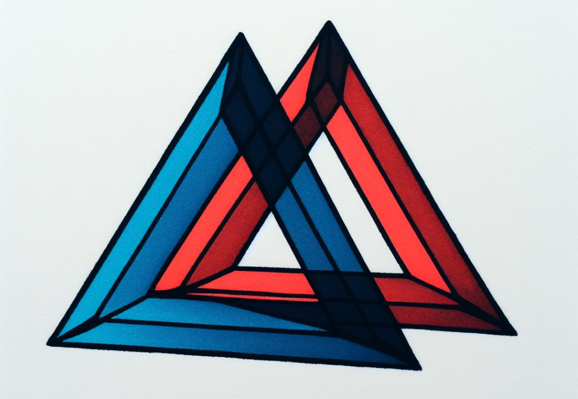
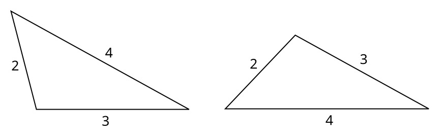
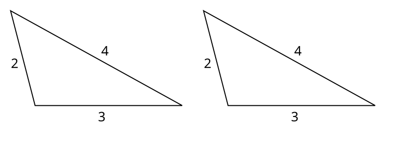
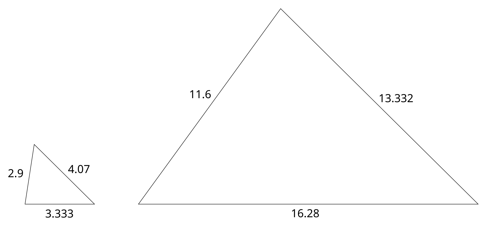
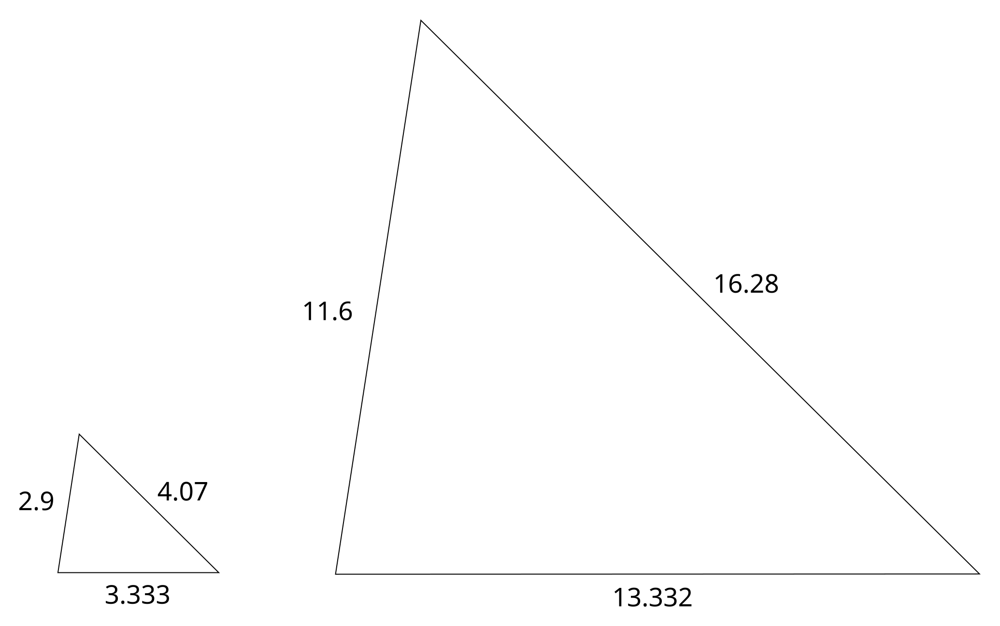

# Dva trojúhelníky



V rovině se nachází dva trojúhelníky ABC a KLM. Vstupem programu budou na samostatných řádcích délky stran (nezáporná desetinná čísla do 10 000) těchto trojúhelníků – nejdříve strany prvního, poté druhého.

Úkolem je vypsat jednu z možností:

- Některý trojúhelník nesplňuje [trojúhelníkovou nerovnost](https://cs.wikipedia.org/wiki/Troj%C3%BAheln%C3%ADkov%C3%A1_nerovnost) a nelze jej sestrojit – `invalid`.
- Trojúhelníky jsou [shodné](https://cs.wikipedia.org/wiki/V%C4%9Bty_o_shodnosti_troj%C3%BAheln%C3%ADku) – `congruent`.
- Trojúhelníky nejsou shodné, ale jsou [podobné](https://cs.wikipedia.org/wiki/Podobnost_(geometrie)) – `similar`.
- Trojúhelníky nejsou shodné a ani podobné – `different`.

Pozn.: trojúhelníkovou nerovností je myšleno, že součet délek každých dvou stran musí být **delší** než strana třetí.

Pozn.: shodností je myšlena shodnost přímá i nepřímá. Trojúhelníky ji tedy splňují tehdy, když je možné je např. při vystřihnutí z papíru vzájemně zcela překrýt. Je dovoleno i otáčení a překlopení – jde jen o shodné délky stran.

## Příklad #1

### Vstup

```
4
2
3
3
2
4
```

### Výstup

```
congruent
```

### Vysvětlení

Rovina vypadá takto:



Po otočení a překlopení druhého trojúhelníku je vidět, že jsou shodné:



## Příklad #2

### Vstup

```
4.07
2.9
3.333
13.332
11.6
16.28
```

### Výstup

```
similar
```

### Vysvětlení

Rovina vypadá takto:



Po otočení a překlopení druhého trojúhelníku je vidět, že jsou podobné:


