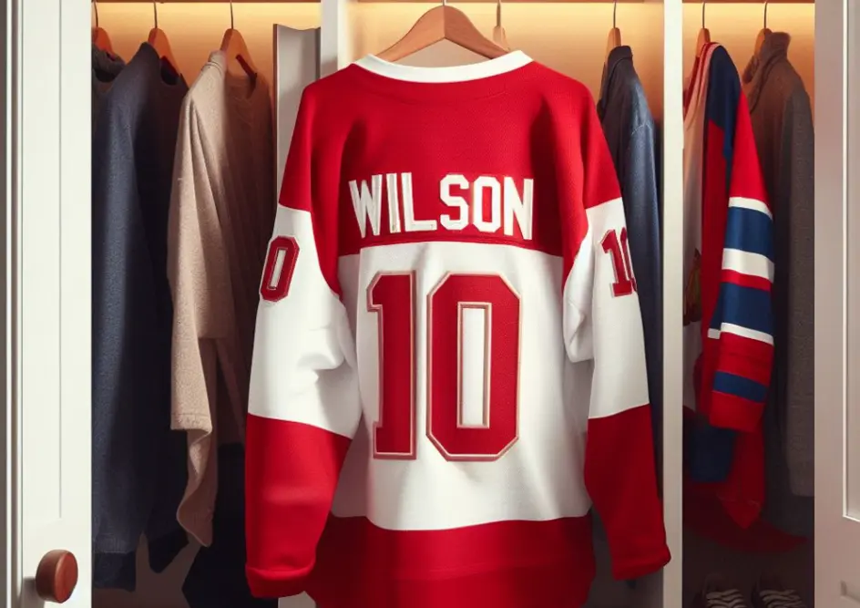

# Dresy



Na vstupu programu bude

- celé číslo `n` (od 1 do 1000) – počet členů hokejového týmu,
- prázdný řádek
- `n` celých čísel (od 0 do 100), které mají hráči na dresech.

Úkolem je vypsat `even`, pokud je hráčů se sudým číslem více. Je-li je více s lichým, vypsat `odd`. A nebo `equal`, když je jich stejně.

## Příklad

### Vstup

```
6

2
91
68
3
17
75
```

### Výstup

```
odd
```

---

- [řešení](reseni)
- [testy](testy)
