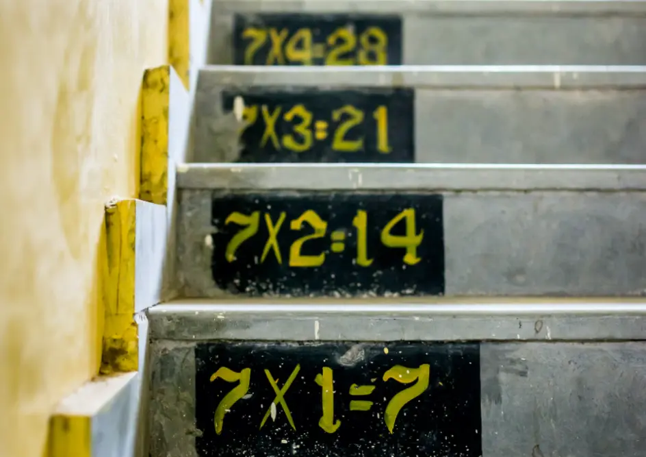

# Tabulka násobků



Na vstupu programu budou na samostatných řádcích celá čísla `m` a `n`, každé v rozsahu od 1 do 1000.

Úkolem je vypsat tabulku násobků s řádky od 1 do `n` a sloupci od 1 do `m`. V každé buňce tabulky bude součin čísla řádku s číslem sloupce.

Tabulka bude formátována následovně:

- Řádky budou odděleny čarou tvořenou ze znaku spojovníku (`-`). Tato čára bude také navrchu i naspodu tabulky.
- Sloupce budou v řádku odděleny znakem svislítka (`|`). Tím bude také každý řádek tabulky začínat a končit. Číslo bude od svislítek z obou stran odděleno mezerou. Ne všechny sloupce budou stejně široké – některé budou muset být širší, aby se i víceciferná čísla do buněk „vešla“. Kratší čísla budou zarována doprava pomocí mezer.

## Příklad #1

### Vstup

```
3
5
```

### Výstup

```
---------------
| 1 |  2 |  3 |
---------------
| 2 |  4 |  6 |
---------------
| 3 |  6 |  9 |
---------------
| 4 |  8 | 12 |
---------------
| 5 | 10 | 15 |
---------------
```

### Vysvětlení

Buňka vždy obsahuje součin čísla svého řádku a svého sloupce. Např. čtvrtý řádek, třetí sloupec: 4 × 3 = 12. Druhý a třetí sloupec obsahují dvojciferná čísla, a tak jsou širší.

## Příklad #2

### Vstup

```
11
11
```

### Výstup

```
----------------------------------------------------------
|  1 |  2 |  3 |  4 |  5 |  6 |  7 |  8 |  9 |  10 |  11 |
----------------------------------------------------------
|  2 |  4 |  6 |  8 | 10 | 12 | 14 | 16 | 18 |  20 |  22 |
----------------------------------------------------------
|  3 |  6 |  9 | 12 | 15 | 18 | 21 | 24 | 27 |  30 |  33 |
----------------------------------------------------------
|  4 |  8 | 12 | 16 | 20 | 24 | 28 | 32 | 36 |  40 |  44 |
----------------------------------------------------------
|  5 | 10 | 15 | 20 | 25 | 30 | 35 | 40 | 45 |  50 |  55 |
----------------------------------------------------------
|  6 | 12 | 18 | 24 | 30 | 36 | 42 | 48 | 54 |  60 |  66 |
----------------------------------------------------------
|  7 | 14 | 21 | 28 | 35 | 42 | 49 | 56 | 63 |  70 |  77 |
----------------------------------------------------------
|  8 | 16 | 24 | 32 | 40 | 48 | 56 | 64 | 72 |  80 |  88 |
----------------------------------------------------------
|  9 | 18 | 27 | 36 | 45 | 54 | 63 | 72 | 81 |  90 |  99 |
----------------------------------------------------------
| 10 | 20 | 30 | 40 | 50 | 60 | 70 | 80 | 90 | 100 | 110 |
----------------------------------------------------------
| 11 | 22 | 33 | 44 | 55 | 66 | 77 | 88 | 99 | 110 | 121 |
----------------------------------------------------------
```
