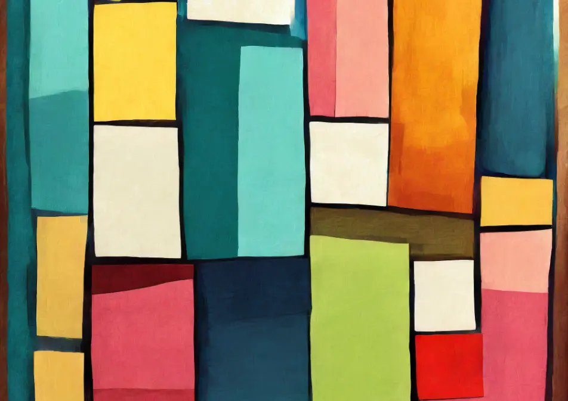

# Barvení



Je potřeba napsat program k barvení čtverečkovaného papíru.

Na vstupu programu budou čísla

- `w` – šířka papíru,
- `h` – výška papíru,
- `n` – počet obdélníků,
- prázdný řádek,
- `n` obdélníků, každý popsaný na pěti řádcích:
    - `x` – sloupec levého horního rohu,
    - `y` – řádek levého horního rohu,
    - `a` – šířka,
    - `b` – výška,
    - prázdný řádek.

Všechna čísla na vstupu jsou celá a v rozsahu od 1 do 1 000. Jednotkou velikostí i souřadnic je čtvereček na papíře.
Souřadnice jsou číslované od 1. Obdélníky budou mít vždy takové souřadnice a velikost, že se na papír vejdou, tedy nikdy
nebudou přesahovat okraj.

Obdélníky se na papíře mohou překrývat. Záleží však pouze na tom, zda je každý čtevreček obarvený nebo prázdný. Tedy,
obarvený čtevreček se překrytím více obdélníků už nikdy neodbarví.

Úkolem je vykreslit, jak bude obarvený papír po všech krocích vypadat. Každý čtvereček bude vyobrazen jedním znakem:
prázdný tečkou (`.`) a obarvený křížkem (`#`). Řádky papíru tak budou odpovídat řádkům textu na výstupu.

## Příklad

### Vstup

```
12
10
3

2
2
3
4

3
4
9
1

11
6
2
4
```

### Výstup

```
............
.###........
.###........
.##########.
.###........
..........##
..........##
..........##
..........##
............
```

### Vysvětlení

Papír je široký 12 a vysoký 10 čtverečků. Pak následují 3 kroky:

- Obdélník s levým horním rohem v souřadnicích [2; 2], šířkou 3 a výškou 4.
- Obdélník s levým horním rohem v souřadnicích [3; 4], šířkou 9 a výškou 1. Ten se s prvním obdélníkem částečně
  překrývá.
- Obdélník s levým horním rohem v souřadnicích [11; 6], šířkou 2 a výškou 4.

---

- [řešení](reseni)
- [testy](testy)
