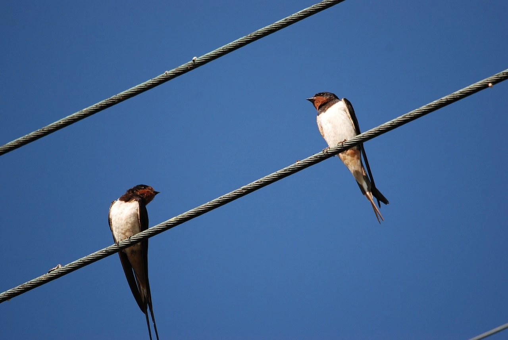
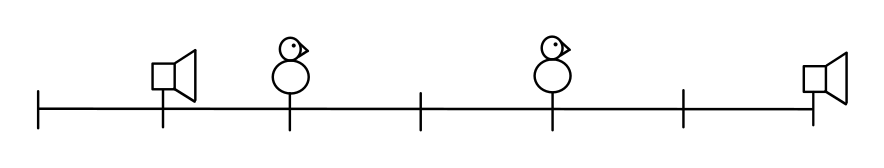
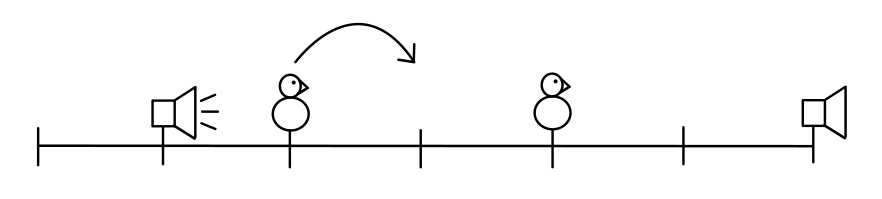
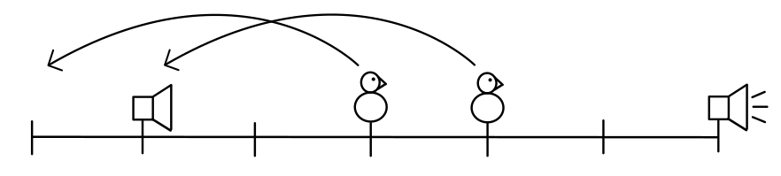
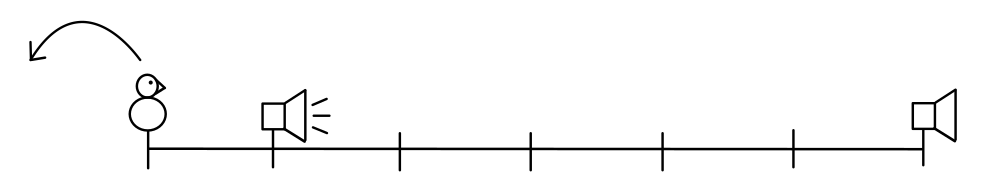

# Ptáci



Na drátu mezi sloupy elektrického vedení sedávají ptáci, kteří místního starostu ruší zpěvem při práci. Naštěstí pro něj
jsou na všech sloupech, mezi nimiž je drát natažen, umístěny ampliony obecního rozhlasu.

Na vstupu programu bude (na samostatných řádcích)

- délka drátu `d` v metrech (celé číslo od 1 do 1 000 000),
- počet sedících ptáků `p` (celé číslo od 0 do `d`, včetně),
- prázdný řádek,
- `p` řádků, na každém pozice jednoho ptáka – jeho vzdálenost od levého konce drátu v metrech (celé číslo od 0 do `d`,
  včetně),
- prázdný řádek,
- počet sloupů `s` (celé číslo od 0 do `d`, včetně),
- prázdný řádek,
- `s` sloupů, každý na čtyřech řádcích:
    - pozice – jeho vzdálenost od levého konce drátu v metrech (celé číslo od 0 do `d`, včetně),
    - hlasitost amplionu `h` (celé číslo od 0 do `d`, včetně),
    - výška tónu amplionu `v` (celé číslo od 0 do `d`, včetně),
    - prázdný řádek,
- počet zvuků, které starosta na amplionech přehrál `z` (celé číslo od 0 do 1 000 000),
- prázdný řádek,
- `z` řádků, na každém z nich pozice amplionu, ze kterého se zvuk ozval (celé číslo od 0 do `d`, včetně).

Na jednom místě vždy stojí nejvýše jeden sloup nebo sedí nejvýše jeden pták. Pták nikdy nesedí na stejném místě, na
kterém stojí sloup. Na obou koncích (vlevo i vpravo) může být drát volný (nezavěšený na sloupu), tedy na první a
poslední možné pozici sloup může, ale nemusí stát. Zvuky z amplionů jsou uvedeny v pořadí, v jakém je starosta přehrál.

Protože však starosta nechce plašením ptactva rušit také lidské obyvatele, může v jednu chvíli nechat přehrát tón jen na
jednom z amplionů. Zvuk vždy vyplaší pouze opeřence, kteří jsou od něj vzdáleni nanejvýš tolik metrů, jaká je jeho
hlasitost (`h`). Ti pak přelétnou směrem od hlučícího amplionu o tolik metrů, jaká je jeho výška tónu (`v`) a na této
nové pozici se usadí.

<div style="page-break-after: always;"></div>

Je možné, že na nové pozici pro vyplašeného ptáka

- bude stát sloup, nebo
- bude sedět jiný pták, nebo
- nebude ani natažen drát (pozice bude vlevo před začátkem nebo vpravo za koncem drátu).

V takovém případě pěvec nemůže přistát, a tak odletí do vedlejší vesnice, čímž je úspěšně odehnán.

Vyplašení ptáci vzlétají a dosedají na nové pozice všichni naráz. To znamená, že si navzájem nepřekáží. Tedy: vyplašený
pták může dosednout na místo, na kterém seděl jiný, který byl vyplašen stejným zvukem.

Úkolem programu je vykreslit stav na drátě po přehrání všech zadaných zvuků. Drát bude vypsán zleva doprava na jeden
řádek, a to následovně:

- volná pozice: spojovník (`-`),
- sloup: svislítko (`|`),
- pták: písmeno O (`O`).

## Příklad #1

### Vstup

```
6
2

2
4

2

1
2
1

6
3
3

3

1
6
1
```

### Výstup

```
-|----|
```

<div style="page-break-after: always;"></div>

### Vysvětlení

Drát má délku 6 metrů. Ale pozor: je na něm dohromady 7 možných pozic pro sloupy a ptáky (na levém konci je i pozice 0).
Je zavěšen na dvou sloupech:

- na pozici 1 s hlasitostí 2 a výškou tónu 1,
- na pozici 6 s hlasitostí 3 a výškou tónu 3.

Na drátu sedí dva ptáci na pozicích 2 a 4.

Nákres rozmístění tedy vypadá takto:



Přehraje se zvuk z amplionu na pozici 1, čímž se levý pták posune o výšku tónu tohoto amplionu (1) směrem od něj –
doprava. Pravý pták však sedí od amplionu dál, než je jeho hlasitost (2), a tak jej zvuk neovlivní.

Nákres:



Když se poté přehraje zvuk z druhého amplionu (pozice 6), posunou se oba ptáci o 3 metry doleva. Jeden z nich (pravý) by
musel přistát na místě, kde stojí levý sloup, což není možné, takže je odehnán.

Nákres:



Nakonec zbývá už jen rozeznít levý amplion a posunout tím posledního ptáka na místo, kde není drát. Na drátě tak
nezbydou žádní ptáci.

Nákres:



<div style="page-break-after: always;"></div>

## Příklad #2

### Vstup

```
9
4

1
3
6
8

2

2
2
1

7
3
3

4

2
7
2
2
```

### Výstup

```
--|--O-|--
```

---

- [řešení](reseni)
- [testy](testy)
