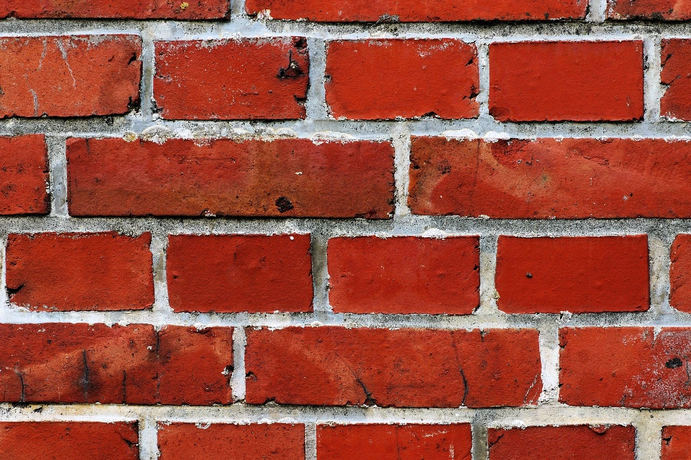

# Zídka



Na vstupu programu bude (na samostatných řádcích)

- výška zídky `h`,
- šířka zídky `w`.

Oba rozměry znamenají počet cihel v příslušném směru a jsou to celá čísla od 0 do 1 000.

Cihla se vykresluje pomocí znaků křížku (`#`), konkrétně 11 na šířku a 4 na výšku:

```
###########
#         #
#         #
###########
```

Když dvě cihly sdílí hrany (vertikální i horizontální), jsou spojeny do jedné:

```
#####################
#         #         #
#         #         #
#####################
```

Zídka se vykresluje následovně: Spodní řada je široká přesně `w` cihel. Řada nad ní je o jednu cihlu kratší a posunutá tak, že se cihla vždy nachází nad spárou mezi dvěma spodními. Třetí řada je zase stejná jako první, čtvrtá stejná jako druhá a tak dále. Pokud je zídka široká aspoň 5 cihel, stane se z vrchní řady cimbuří – její první cihla vlevo se vykreslí, druhá ne, třetí ano, čtvrtá ne a tak dále. Pozor: první i poslední cihla z cimbuří musí stát pevně na dvou spodních cihlách, tedy nemůže mít pod sebou způlky prázdno. Jinými slovy, krajní cihly, které tvoři cimbuří, nesmí přesahovat okraje řady pod ní, protože jinak by přepadávaly – vizte příklad #3.

<div style="page-break-after: always;"></div>

## Příklad #1

### Vstup

```
5
4
```

### Výstup

```
#########################################
#         #         #         #         #
#         #         #         #         #
#########################################
     #         #         #         #
     #         #         #         #
#########################################
#         #         #         #         #
#         #         #         #         #
#########################################
     #         #         #         #
     #         #         #         #
#########################################
#         #         #         #         #
#         #         #         #         #
#########################################
```

## Příklad #2

### Vstup

```
4
6
```

### Výstup

```
     ###########         ###########         ###########
     #         #         #         #         #         #
     #         #         #         #         #         #
#############################################################
#         #         #         #         #         #         #
#         #         #         #         #         #         #
#############################################################
     #         #         #         #         #         #
     #         #         #         #         #         #
#############################################################
#         #         #         #         #         #         #
#         #         #         #         #         #         #
#############################################################
```

## Příklad #3

### Vstup

```
3
8
```

### Výstup

```
          ###########         ###########         ###########
          #         #         #         #         #         #
          #         #         #         #         #         #
     #######################################################################
     #         #         #         #         #         #         #         #
     #         #         #         #         #         #         #         #
#################################################################################
#         #         #         #         #         #         #         #         #
#         #         #         #         #         #         #         #         #
#################################################################################
```

### Vysvětlení

Cimbuří začíná až od „druhé“ cihly, jinak by totiž jeho první cihla měla pod sebou prázdný prostor. Zároveň byla jeho poslední cihla vynechána, a to ze stejného důvodu. Na nákresu je znakem `o` naznačeno, kde by se poslední cihla nacházela, kdyby vynechána nebyla. Jak je vidět, přepadávala by doprava:

```
          ###########         ###########         ###########         ooooooooooo
          #         #         #         #         #         #         o         o
          #         #         #         #         #         #         o         o
     #######################################################################ooooo
     #         #         #         #         #         #         #         #
     #         #         #         #         #         #         #         #
#################################################################################
#         #         #         #         #         #         #         #         #
#         #         #         #         #         #         #         #         #
#################################################################################
```

---

- [řešení](reseni)
- [testy](testy)
