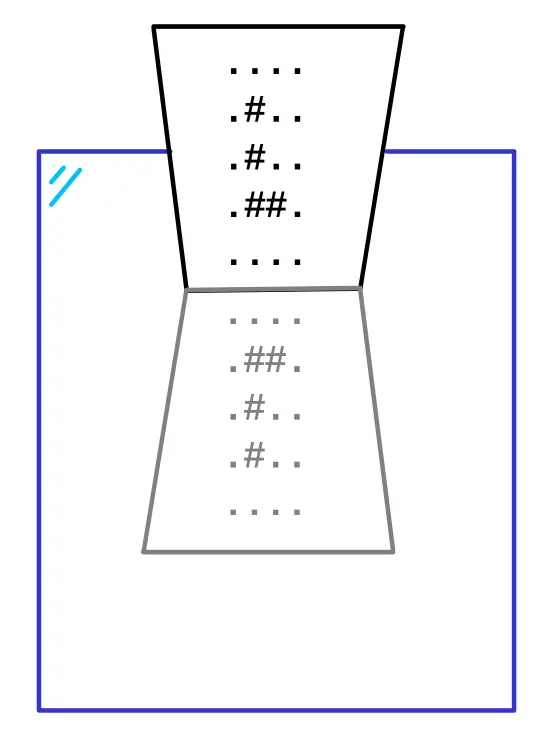

# Zrcadlo


K zrcadlu je přiložen potištěný papírek.

Na vstupu programu bude (na samostatných řádcích)

- šířka papírku `w`,
- výška papírku `h`,
- znak určující, z jakého směru je k zrcadlu papírek přiložen:
    - `s` – spodní hranou,
    - `p` – pravou boční hranou,
- prázdný řádek,
- `w` × `h` řádků, na každém jeden znak natištěný na papírku.

Rozměry papírku znamenají počet znaků v daném směru a budou to celá čísla od 0 do 1000. Znaky na něm natisklé nebudou
mezery ani jiné bílé znaky.

Znaky jsou na vstupu uvedeny v pořadí po řádcích zleva doprava. Takže prvních `w` znaků je první řádek, druhých `w`
znaků je druhý řádek a tak dále.

Úkolem je vypsat znaky tak, jak jsou vidět na převráceném obraze papírku v zrcadle. Cílem je zrcadlově převrátit pořadí
znaků, jednotlivé znaky není potřeba obracet. Sklon papírku je také zanedbán.

<div style="page-break-after: always;"></div>

## Příklad #1

### Vstup

```
4
5
s

.
.
.
.
.
#
.
.
.
#
.
.
.
#
#
.
.
.
.
.
```

### Výstup

```
....
.##.
.#..
.#..
....
```

### Vysvětlení

Na papírku jsou znaky ve tvaru písmene L:

```
....
.#..
.#..
.##.
....
```

<div style="page-break-after: always;"></div>

Po přiložení papírku k zrcadlu spodní hranou (`s` na vstupu) dojde k převrácení do této polohy:



Odraz (šedý převrácený text) byl vypsán na výstup.

## Příklad #2

### Vstup

```
4
5
p

.
.
.
.
.
#
#
.
.
#
.
.
.
#
#
.
.
.
.
.
```

### Výstup

```
....
.##.
..#.
.##.
....
```

---

- [řešení](reseni)
- [testy](testy)
