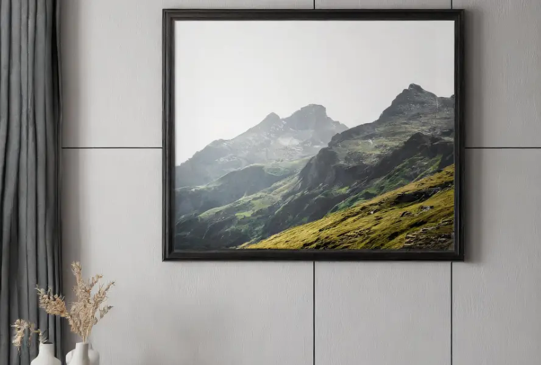

# Obraz



Na vstupu programu bude (na samostatných řádcích)

- šířka obrazu `w`,
- výška obrazu `h`,
- prázdný řádek,
- `w` × `h` řádků, na každém jeden znak na obraze.

Rozměry obrazu znamenají počet znaků v daném směru a budou to celá čísla od 3 do 1000. Znaky na něm nebudou mezery ani
jiné bílé znaky.

Znaky jsou na vstupu uvedeny v pořadí po řádcích zleva doprava. Takže prvních `w` znaků je první řádek, druhých `w`
znaků je druhý řádek a tak dále.

Obraz je orámován

- na svislých hranách svislítky (`|`),
- na vodorovných hranách spojovníky (`-`),
- v rozích malým písmenem `x`.

V rámu jsou připraveny šrouby pro zavrtání do zdi značené malým písmenem `o`. Šrouby se nachází na různých místech, ale
v jedné ze čtyř hran rámu budou vždy umístěny dva. Tato hrana má být při upevnění obrazu na stěnu vodorovná a
orientovaná vzhůru – obraz na ní bude „zavěšen“.

Šrouby mohou být připraveny i v rozích rámu. Více než dva šrouby se na jedné hraně nacházet nebudou a dva šrouby bude
mít pouze jediná hrana.

Úkolem je vykreslit obraz i s rámem natočený tak, aby „visel“ na správné hraně (té, na níž jsou dva šrouby). S obrazem
je možno pouze otáčet (po nebo proti směru hodinových ručiček), nelze jej převracet. Znaky uvnitř obrazu nebudou
změněny. Znaky rámu je však nutno vykreslit tak, aby i po natočení byla na svislých hranách stále svislítka a na
vodorovných spojovníky.

<div style="page-break-after: always;"></div>

## Příklad

### Vstup

```
5
4

o
-
-
-
x
|
.
#
-
|
o
#
#
.
|
x
-
-
o
x
```

### Výstup

```
xo-o
|#.|
|##|
o.-|
x--x
```

### Vysvětlení

Obraz ze zadání vypadá takto:

```
o---x
|.#-|
o##.|
x--ox
```

Aby visel správně, bylo nutné jej otočit o 90 stupňů po směru hodinových ručiček. Oproti zadání bylo také potřeba
svislítka a spojovníky v rámu upravit, aby měly i po otočení obrazu správnou orientaci. Pozor: spojovník uvnitř obrazu
však zůstal nezměněný.