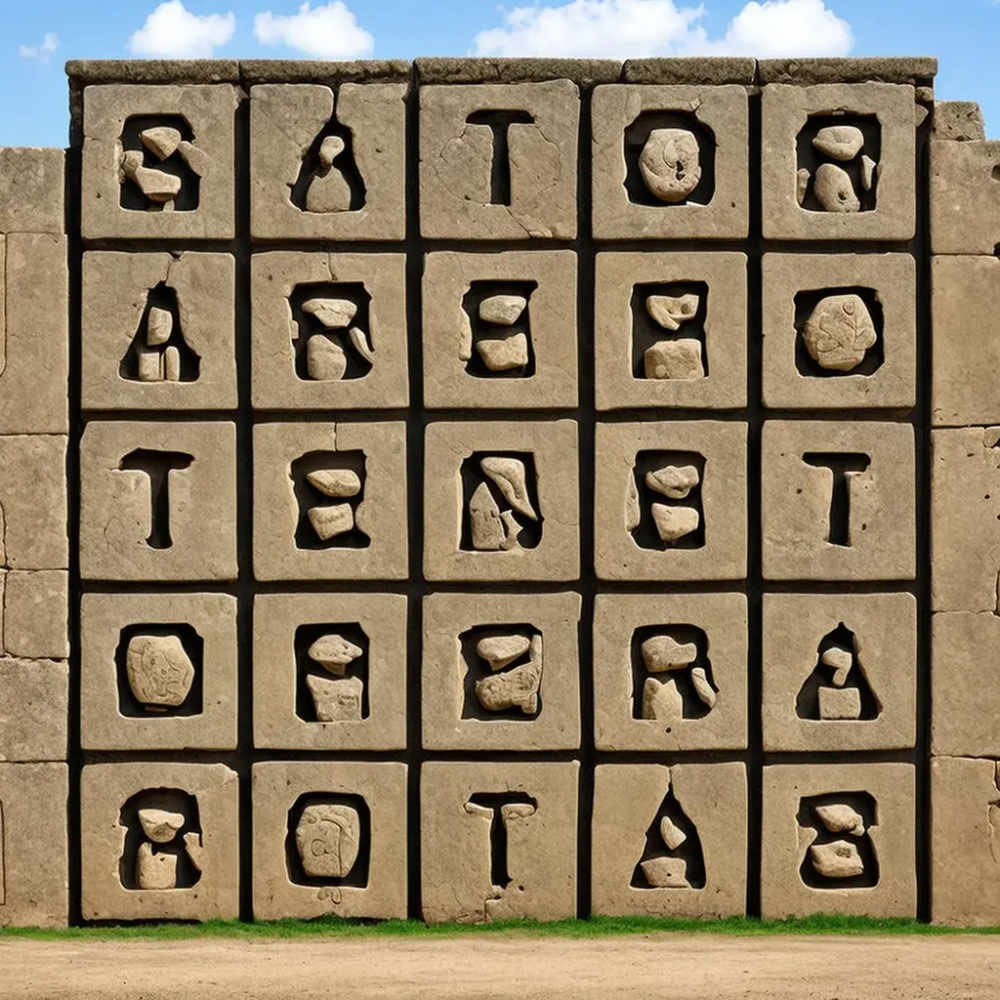

# Palindrom



Vstupem programu bude (na samostatných řádcích)

- několik slov oddělených jednou mezerou (dohromady o délce nejvýše 1 000 znaků),
- označení jazyka: `cz` (čeština) nebo `en` (angličtina).

Řádek se slovy nebude začínat ani končit mezerou nebo jiným bílým znakem. Slova budou obsahovat pouze písmena anglické
abecedy (i když bude jazyk `cz`).

Úkolem je vypsat, zda řádek slov je (`true`) nebo není (`false`) palindromem – lze jej číst v obou směrech (zleva
doprava a naopak) a nezmění se.

Platí tato pravidla:

1. Malá a velká písmena nejsou při čtení z různých směrů rozlišována.
2. Mezery mezi slovy se do vyhodnocení nezahrnují – pouze písmena ano. Jinak řečeno, pakliže se čtení z jednoho směru
   liší oproti opačnému směru pouze mezerami, stále jde o palindrom.
3. Pokud je jako jazyk zadána čeština, potom `ch` ve slově je samostatné české písmeno *ch*. Tomu se i určení palindromu
   musí přizpůsobit – vizte příklad #4. Pozor: ačkoli mezery v palindromu nehrají roli, končí-li jedno slovo na `c` a
   další začíná na `h`, nelze to považovat za písmeno *ch* – vizte příklad #5.

## Příklad #1

### Vstup

```
Hannah
en
```

### Výstup

```
true
```

<div style="page-break-after: always;"></div>

## Příklad #2

### Vstup

```
borrow or rob
en
```

### Výstup

```
true
```

## Příklad #3

### Vstup

```
chram march
en
```

### Výstup

```
false
```

## Příklad #4

### Vstup

```
Chalupa cha pul ach
cz
```

### Výstup

```
true
```

## Příklad #5

### Vstup

```
a vec ha cheva
cz
```

### Výstup

```
false
```

<div style="page-break-after: always;"></div>

---

- [řešení](reseni)
- [testy](testy)
