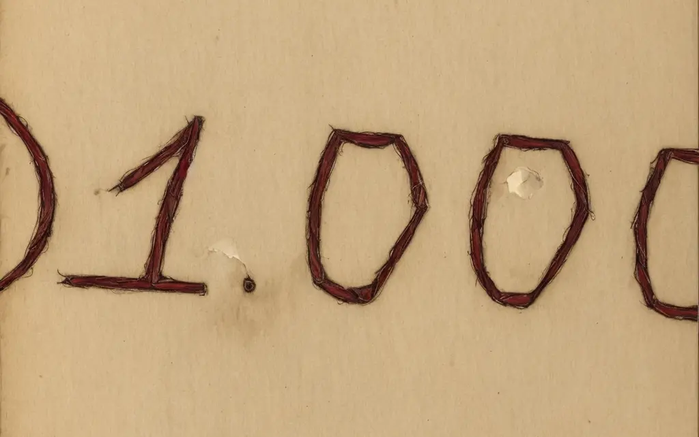

# Desítkový rozklad II



Tato úloha rozšiřuje listopadovou
úlohu [Desítkový rozklad](https://github.com/delta-cs/seminar/tree/main/ulohy/15-desitkovy-rozklad).

Na vstupu programu bude nezáporné celé nebo desetinné číslo, které může mít až 1 000 cifer – pozor: nebude na něj
tedy stačit žádný z číselných datových typů.

Úkolem je vypsat rozklad tohoto čísla na mocniny čísla 10 (…setiny, desetiny, jednotky, desítky, stovky…). Rozklad bude
na jednotlivých řádcích od nejvyšší po nejnižší mocninu a ve formátu `n x d`, kde `n` je násobek a `d` je mocnina 10.
Když je násobek 0, řádek se ve výpisu neobjeví.

## Příklad

### Vstup

```
32.057
```

### Výstup

```
3 x 10
2 x 1
5 x 0.01
7 x 0.001
```

### Vysvětlení

Číslo 32.057 má 3 desítky, 2 jednotky, 5 setin a 7 tisícin.

---

- [řešení](reseni)
- [testy](testy)
