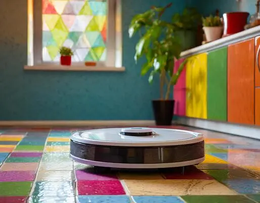

# Kuchyňský robovysavač



Na vstupu programu budou (na samostatných řádcích)

- rozměry kuchyně: délka `h` a šířka `w` (dvě celá čísla od 2 do 50 oddělená mezerou), jednotkou je jedna kachlička,
- podlaha v kuchyni vykreslená z pohledu shora: `h` řádků o `w` kachličkách,
- souřadnice robovysavače: řádek a sloupec (dvě celá čísla oddělená mezerou, číslovaná od 1),
- souřadnice jeho nabíjecí stanice: řádek a sloupec (dvě celá čísla oddělená mezerou, číslované od 1).

Každá kachlička bude jedno malé písmeno anglické abecedy. Na řádku od sebe budou odděleny mezerou. Kachličky budou v
nejvýše 10 různých barvách. Vysavač se vždy bude nacházet jinde než stanice.

Písmeno kachličky značí její barvu. Tedy, všechny kachličky se stejným písmenem mají stejnou barvu.

Vysavač může jezdit do čtyř směrů: doleva, doprava, dopředu nebo dozadu. Lze mu nastavit program, podle kterého se má
pohybovat. O směru pohybu vysavač rozhoduje vždy podle toho, na jaké barvě kachličky právě stojí. Program přiřazuje ke
všem existujícím barvám kachliček směr, jakým se má vysavač pohnout, když se nachází na kachličce této barvy.

Když se vysavač dostane ke stěně kuchyně a měl by se podle programu pohnout směrem do ní, zůstane stát na místě.

Úkolem je vypsat jedno celé číslo: počet všech možných programů, kterými se vysavač přesune z počátečních souřadnic na
souřadnice své nabíjecí stanice.

<div style="page-break-after: always;"></div>

## Příklad #1

### Vstup

```
5 6
r r r r r r
r b g g g r
r b r r r r
r b b g r r
r r r r r r
4 5
4 2
```

### Výstup

```
3
```

### Vysvětlení

Když označíme barvu kachliček `r` jako červenou, `g` zelenou a `b` modrou, vypadá kuchyňská podlaha takto:


Kružnice značí vysavač a čtverec nabíjecí stanici. Dohromady jsou tři možné programy, jak vysavač nastavit, aby se
dostal do stanice.

1. `r` – dopředu, `g` – doleva, `b` – dozadu:

   

<div style="page-break-after: always;"></div>

2. `r` – doleva, `g` – dopředu, `b` – dozadu:

   

3. `r` – doleva, `g` – doleva, `b` – doleva:

   

## Příklad #2

### Vstup

```
3 2
a b
c d
e f
2 2
3 1
```

### Výstup

```
1092
```
